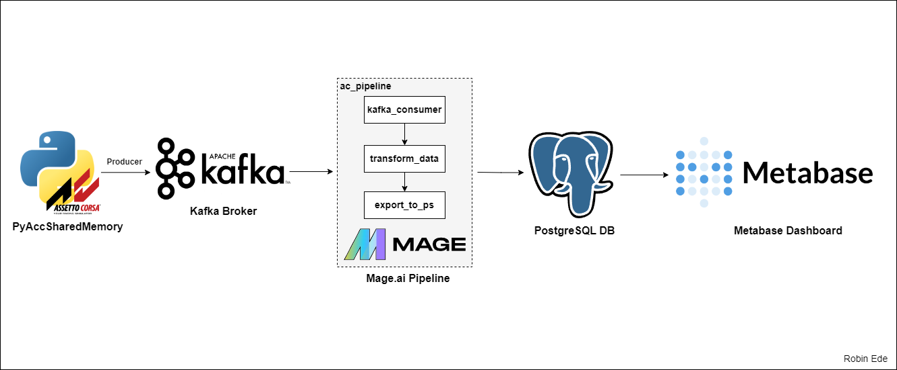
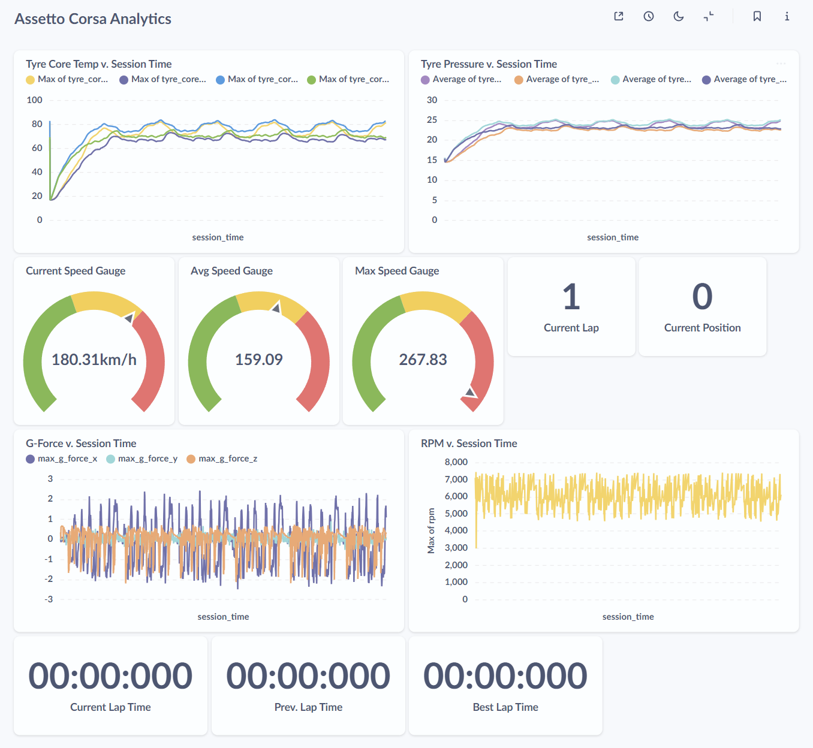

# Assetto Corsa Streaming Data Project

## Introduction

This project aims to create a real-time data pipeline for collecting, processing, and visualizing telemetry data from Assetto Corsa Competizione (ACC), a popular racing simulation game. The project utilizes Mage for ETL processes, Kafka as a streaming broker, PostgreSQL as the data warehouse, and Metabase for creating interactive visualizations. By leveraging these open-source tools, we provide real-time insights into vehicle performance metrics and driver statistics.

## Project Goals

The primary objectives of this project are:

1. **Automate Data Collection**: Collect telemetry data from ACC, such as speed, tire pressure, and lap times, using a custom producer.
2. **Streaming ETL Pipeline**: Use Mage to implement an ETL pipeline for processing real-time data and transforming it before loading it into a warehouse.
3. **Data Storage & Visualization**: Store transformed data in PostgreSQL* and create interactive dashboards using Metabase to visualize driver and vehicle statistics in real time.
4. **Scalability**: Ensure the pipeline can handle large volumes of data efficiently by using distributed, containerized components.

## Architecture Diagram



## Technologies Used

- [**Mage**](https://www.mage.ai/): Open-source ETL tool for managing data transformations.
- [**Apache Kafka**](https://kafka.apache.org/downloads): For message brokering between producer and consumer.
- [**PostgreSQL**](https://www.postgresql.org/download/): To store the telemetry data for analysis.
- [**Metabase**](https://www.metabase.com/start/oss/): For building and visualizing interactive dashboards.
- [**Docker & Docker Compose**](https://www.docker.com/products/docker-desktop/): To containerize all components for simplified deployment.
- [**Python**](https://www.python.org/downloads/): For the custom producer that streams telemetry data.
- [**PyAccSharedMemory**](https://github.com/rrennoir/PyAccSharedMemory/): To read telemetry data from ACC via shared memory in real time.

## How It Works

### Data Pipeline

1. **Data Producer**: The `scripts/telemetry_producer.py` script produces telemetry data from Assetto Corsa Competizione and streams it to a Kafka topic using the PyAccSharedMemory library.
2. **Kafka Broker**: Kafka manages the real-time data flow, making it available for further transformation.
3. **Mage ETL Pipeline**: The data passes through a Mage ETL pipeline for transformation and cleaning, ensuring it is properly formatted before being loaded.
4. **Data Storage**: The cleaned data is loaded into PostgreSQL for storage.
5. **Visualization**: Metabase uses the data from PostgreSQL to create real-time dashboards, providing insight into driver performance.

## Project Structure

```
.
├── assetto-corsa-mage/          # Directory containing Mage ETL pipeline configurations
├── images/                      # Directory with visual assets for documentation
│   ├── architecture_diagram.png # Architecture diagram for the project
│   └── sample_visualization.png # Example of the Metabase dashboard visualization
├── scripts/                     # Directory for Python scripts
│   ├── telemetry_producer.py    # Script to produce telemetry data from ACC
│   └── init.sql                 # Initialization script for setting up PostgreSQL schema
├── docker-compose.yaml          # Docker Compose file to orchestrate all services
├── README.md                    # Project README file
└── requirements.txt             # Python dependencies for running the telemetry producer script
```

### Key Files and Directories

- **`assetto-corsa-mage/`**: Contains configurations for the Mage ETL pipeline, which defines data extraction, transformation, and loading tasks.
- **`scripts/`**:
  - **`telemetry_producer.py`**: The Python script responsible for collecting telemetry data from Assetto Corsa Competizione using PyAccSharedMemory and streaming it to Kafka.
  - **`init.sql`**: SQL script to set up the PostgreSQL database schema, including creating tables and any necessary initial configurations.
- **`docker-compose.yaml`**: Configuration file for Docker Compose, used to deploy and run Kafka, PostgreSQL, Mage, and Metabase as containerized services.
- **`requirements.txt`**: Lists the Python dependencies needed to run the telemetry producer script.

## Installation Steps

### Prerequisites

1. **Docker** and **Docker Compose** installed on your machine.
2. **Python environment**: To run the telemetry producer script.
3. **Assetto Corsa** or **Assetto Corsa Competizione** on your local machine

### Setup Instructions

1. **Clone the Repository**
   ```bash
   git clone https://github.com/robin-ede/ac-data-eng-project.git
   cd ac-data-eng-project
   ```

2. **Install Python Dependencies**
   - Create a virtual environment and install the required packages.
   ```bash
   python -m venv venv
   source venv/bin/activate  # On Windows use `venv\Scripts\activate`
   pip install -r requirements.txt
   ```

3. **Build and Start Docker Containers**
   ```bash
   docker-compose up -d
   ```

4. **Verify Mage Pipeline Setup**
   - Open your browser and go to `http://localhost:6789` and navigate to the **ac_pipeline** in the Mage UI.
   - Initialize the pipeline to ensure it is ready to handle Kafka streams.

5. **Run the Data Producer**
   - Start Assetto Corsa Competizione or Assetto Corsa on your machine.
   - Begin a race session in the game to generate telemetry data.
   - Navigate to the `scripts` directory.
   ```bash
   cd scripts
   python telemetry_producer.py
   ```

6. **Configure Metabase**
   - Start Metabase using Docker Compose and open your browser to `http://localhost:3000`.
   - Complete the initial setup with your information (e.g., name, email, and password).
   - **Connect to PostgreSQL**:
     - Database Type: PostgreSQL; Host: `analytics-postgres`; Port: `5432`.
     - Database Name: `analyticsdb`; Username: `analytics`; Password: `analytics_password`.

## Results

After successfully setting up and running the pipeline, the following outputs are generated:

1. **Real-Time Data in PostgreSQL**: The telemetry data from Assetto Corsa Competizione is collected, processed, and stored in PostgreSQL.
2. **Interactive Dashboards**: Using Metabase, users can visualize driver stats such as speed, tire pressure, race position, lap times, etc.

   
3. **Live Dashboard Demonstration**: Watch the following video for a demonstration of the live dashboard in action during an actual race: https://www.youtube.com/watch?v=y1Xymd8Zgic

## Future Work

1. **Expand Visualizations**: Add more telemetry metrics, such as brake force and gear usage, to the Metabase dashboards.
2. **Performance Optimization**: Tune the Mage ETL pipeline to handle larger volumes of telemetry data.
3. **Machine Learning Integration**: Incorporate predictive analytics to anticipate vehicle performance based on telemetry data.
4. **Game Data API**: Develop an API for users to query real-time game stats for other applications.
5. **Game Compatibility**: Note that PyAccSharedMemory was developed for Assetto Corsa Competizione. However, this project uses the older version, Assetto Corsa, which may explain why some telemetry metrics like brake temperature, gap ahead/behind, etc., are not being recognized.
6. **Expand script functionality**: Modify the telemetry producer script to collect data not only from user-controlled cars but also from other player or AI-controlled cars, providing broader insights into overall race dynamics.
